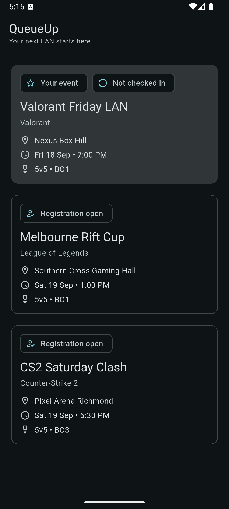
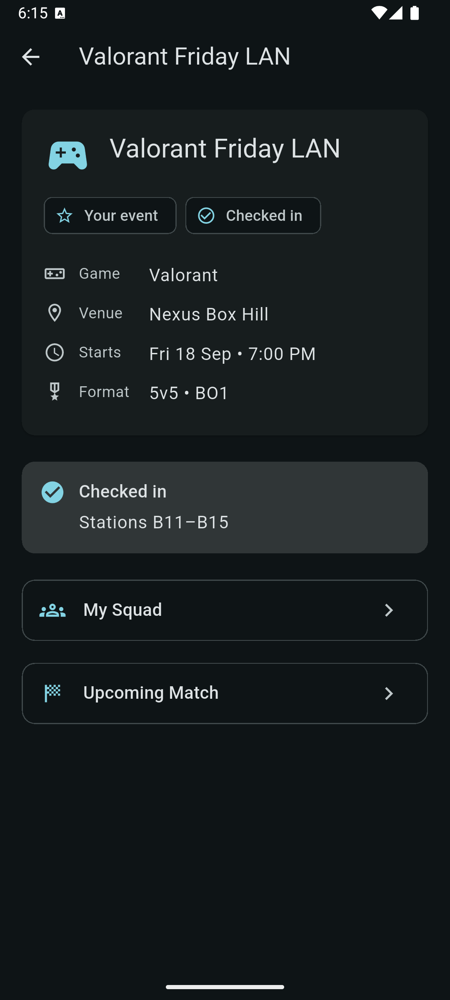
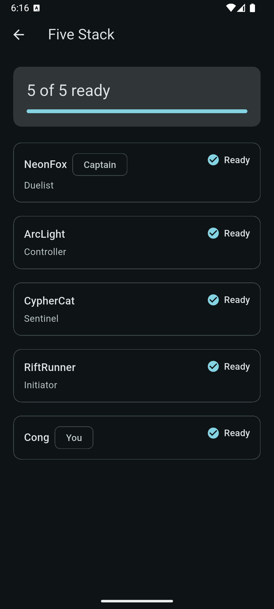
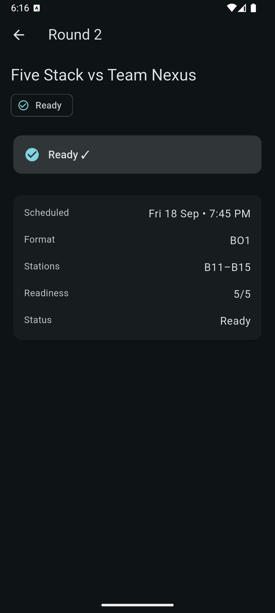

# QueueUp — Flutter Esports Tournament Companion

QueueUp is a compact Android Flutter application for players attending in-person esports
tournaments. A player finds their event, checks in at the venue, receives a gaming-station
assignment, and confirms readiness for their upcoming match.

It is backed by a deterministic in-memory Fastify API so the whole event → squad → check-in →
match → ready flow can be demonstrated repeatably, including temporary API failure.

> **This is a hiring prototype, not a product.** All data is synthetic and generated by the API.
> Venue names are fictional, and the project claims no affiliation with any venue, operator, or
> company. There is no authentication and no persistence.

---

## The problem

In-person esports events coordinate people who are physically present but not sitting at a
computer: a squad of five has to gather, check in at the venue, learn which stations they have
been assigned, and confirm they are ready before an admin can start their match. Nothing here
works well over email or a desktop dashboard — the player is standing in a hall holding a phone.

That makes it a genuinely mobile workflow, and it is why the artifact is a Flutter application
rather than a web page: the fictional venue is loud and crowded, the player has one hand free,
and the answer to "where do I sit and am I ready?" has to be one tap away and correct even when
the venue Wi-Fi drops.

The interesting engineering is not the screens. It is that check-in and readiness are
**server-enforced workflow invariants** with **idempotent mutations**, and that the app keeps
showing the last confirmed state when the network fails instead of pretending the request
succeeded.

## Screens

| Events | Checked in | Squad ready | Match ready |
|---|---|---|---|
|  |  |  |  |

### Acceptance recording

[Watch the acceptance recording](queueup-demo.mp4) — `queueup-demo.mp4`, 60 seconds, 2.6 MB.

GitHub serves MP4 files from a repository as a download page rather than an inline player, so
open that link and use **Download raw file** to play it.

It covers the full flow end to end: the three event summaries, the featured event detail, the
squad at `4 of 5 ready`, check-in returning the `B11–B15` station assignment, marking ready, the
squad then reflecting `5 of 5 ready` without refetching, and finally a suspended API process — a
failed pull-to-refresh that keeps the confirmed data on screen behind a persistent Retry notice,
the same process resuming, and the notice clearing while the confirmed state survives.

## Architecture

```text
Flutter Android
      │
      │ HTTP
      ▼
Fastify API
      │
      ▼
In-memory deterministic state
```

The contract between the two halves is deliberately small: seven JSON endpoints, string IDs,
explicit status strings, and mutation responses that return every entity the server changed.

```text
queueup/
├── docs/screenshots/
├── mobile/                     Flutter Android app
│   └── lib/
│       ├── main.dart           composition root: theme, http.Client, controller
│       ├── models/             immutable models with strict fromJson
│       ├── services/           QueueUpApi boundary + ApiClient
│       ├── state/              TournamentController + RequestState
│       ├── screens/            Events, Event detail, Squad, Match
│       └── widgets/            shared fatal / stale-notice widget
└── api/                        Fastify API
    └── src/
        ├── app.ts              seed state, routes, invariants, safe errors
        └── server.ts           builds and listens on 0.0.0.0:3000
```

### Request flow

```text
EventsScreen ─────► TournamentController.loadEvents() ─────► QueueUpApi ─────► GET /events
                        │                                                       │
                        │ caches List<Event> + RequestState                     │
                        ▼                                                       ▼
                   ListenableBuilder rebuilds        { id, name, game, venue, startsAt, … }

Check In ────────► TournamentController.checkIn(eventId) ──► POST /events/:id/check-in
                        │
                        └─ response {event, match} replaces BOTH caches, no refetch
```

## API

Base URL for the Android emulator is `http://10.0.2.2:3000` (the emulator's route to the host).
The server always listens on `0.0.0.0:3000`.

```http
GET  /health                    → { "ok": true }
GET  /events                    → Event[]      (three summaries, featured first)
GET  /events/:eventId           → Event        (detail; workflow fields nullable)
GET  /squads/:squadId           → Squad        (five players)
GET  /matches/:matchId          → Match        (round, opponent, stations, readiness)
POST /events/:eventId/check-in  → { event, match }
POST /matches/:matchId/ready    → { match, squad }
```

Every error uses the same safe shape, and nothing else crosses the boundary:

```json
{ "error": "CHECK_IN_REQUIRED", "message": "Check in before marking ready." }
```

`404` for unknown resources, `409` for domain precondition failures, `500` for internal errors
(technical detail is logged server-side only). Readiness follows a fixed decision order: already
ready → `200` unchanged; event not checked in → `409 CHECK_IN_REQUIRED`; match already
`in_progress` or `complete` → `409`; otherwise the current player is marked ready and the
authoritative readiness is recalculated from squad players.

Every `buildServer()` call constructs fresh seed state, so restarting the API is a complete reset.

### Seed data

| Event | Venue | Start | Format | Status |
|---|---|---|---|---|
| Valorant Friday LAN | Nexus Box Hill | 2026-09-18 19:00 +10:00 | 5v5 • BO1 | Your event / Not checked in |
| Melbourne Rift Cup | Southern Cross Gaming Hall | 2026-09-19 13:00 +10:00 | 5v5 • BO1 | Registration open |
| CS2 Saturday Clash | Pixel Arena Richmond | 2026-09-19 18:30 +10:00 | 5v5 • BO3 | Registration open |

The featured event carries `squadId` and `matchId`; the secondary events carry `null` for both.
"Your event" is derived from those two fields, never from a hardcoded event ID or a presentation
flag. Featured squad `Five Stack` is `4 of 5 ready` until Cong (the current user) marks ready.

## Requirements

- Flutter stable (developed against 3.47.4, Dart 3.13.3)
- Node.js LTS (developed against 26.8.2) with npm
- JDK 17+ for the Android release build (developed against OpenJDK 21)
- Android SDK platform-tools (`adb`) on your `PATH`. If `adb` is not found, add it:
  `export PATH="$PATH:$HOME/Library/Android/sdk/platform-tools"`
- A booted Android emulator (developed against a Pixel-sized `medium_phone` AVD, API 36, arm64).
  With no AVD yet:
  `android sdk install emulator "system-images;android-36;google_apis;arm64-v8a"`,
  `android emulator create medium_phone`, then `android emulator start medium_phone`.

## Setup and run

Install API dependencies and start the API. Leave this running:

```bash
cd api
npm install
npm run dev
```

`npm run dev` runs `tsx watch src/server.ts` and prints the listening address. Confirm it:

```bash
curl http://127.0.0.1:3000/health
# {"ok":true}
```

In a second terminal, run the app on a booted emulator:

```bash
cd mobile
flutter pub get
flutter run
```

The default base URL already targets `http://10.0.2.2:3000`, so no extra arguments are needed.

### Pointing the app at another host

The base URL is compile-time configuration (`String.fromEnvironment`), so it can be overridden.
For a physical device on the same network, use the host machine's LAN address:

```bash
flutter run --dart-define=API_BASE_URL=http://192.168.1.20:3000
```

A value that is not an absolute `http`/`https` URL fails fast at launch with a clear message
rather than surfacing later as a mysterious request failure.

## Tests and static checks

```bash
cd mobile
flutter analyze
flutter test

cd ../api
npm run typecheck
npm test
```

- **API tests** (18) run against the real Fastify instance through `app.inject()`: seed shape and
  ordering, featured derivation, unknown-resource `404`s, the safe error shape, check-in
  idempotency (same stations, original `checkedInAt`), the mandatory
  `ready → 409 → check-in → ready → 5/5 → ready` sequence, the terminal-status guard for an
  `in_progress` or `complete` match (arranged through a narrow `buildServer({ initialState })`
  seam, since no endpoint can produce those statuses), fresh-state isolation between two
  `buildServer()` calls, and a `500` path that must not leak internals.
- **Flutter tests** (54) cover strict `fromJson` parsing (malformed JSON, wrong types, missing
  required fields, unknown match status), timestamp and station formatting, `ApiClient` status /
  content-type / timeout / no-retry behavior against a mock HTTP client, and
  `TournamentController` stale-data retention and mutation cache replacement against a fake API.

## Release build and install

```bash
cd mobile
flutter build apk --release --dart-define=API_BASE_URL=http://10.0.2.2:3000
```

The unsplit APK is written to `build/app/outputs/flutter-apk/app-release.apk`. Install and launch
it on a running emulator:

```bash
adb install -r build/app/outputs/flutter-apk/app-release.apk
adb shell am start -W -n dev.queueup.mobile/.MainActivity
```

The release APK must load Events from the real API — that is the smoke test that the cleartext
policy, the `10.0.2.2` host route, and the release build are all correct together.

## Demonstrating failure and recovery

The stale-data behavior is the part worth demonstrating live. The requirement is *temporary API
unreachability without resetting state*, so suspend the process rather than restarting it (a
restart resets the deterministic seed):

```bash
# In the terminal running `npm run dev`:
#   press Ctrl-Z to suspend
#   pull to refresh a screen that has already loaded — cached data stays
#   press fg to resume
#   press Retry in the app — the notice clears
```

Restarting the API (`Ctrl-C`, then `npm run dev`) is the deterministic way to reset the demo to
its initial state.

## Key decisions

**REST over WebSockets.** The workflow is request/response: check in, mark ready, read state.
There is no server-pushed event stream to justify a socket, and the spec forbids polling, timers,
and background refresh. Every screen updates only from a response the user's own action caused.

**One injected `ChangeNotifier`, not a state-management package.** Four screens share one
`TournamentController` that is constructed in `main.dart` and passed through screen constructors,
then observed with `ListenableBuilder`. Cross-screen synchronization (check in on Event details →
Match shows stations; mark ready on Match → Squad shows `5 of 5 ready`) falls out of a single
object owning the caches. Provider or Riverpod would add a dependency without changing any
behavior at this size.

**The API boundary is not a repository layer.** `QueueUpApi` exists so the controller can be
tested against a fake without a socket. It has six explicit methods; there is no generic
`fetch`, no `Result<T>` hierarchy, and no cache abstraction.

**Mutations return every changed entity.** Check-in returns the updated Event *and* Match; ready
returns the updated Match *and* Squad. The controller replaces both caches from that single
response and never refetches, so the client can never disagree with the server about station
assignments or readiness.

**Server-enforced invariants, not client-side guards.** The UI disables **I'm Ready** before
check-in, but the API independently returns `409 CHECK_IN_REQUIRED`. The client guard is a UX
affordance; the server is the authority. Both are tested.

**Strict, handwritten parsing.** Every model has an explicit `fromJson` that throws
`FormatException` on a missing or wrongly-typed required field and on an unknown match status.
Malformed responses become ordinary request failures with safe copy, never a partially-populated
model or a crash.

**Summary and detail caches stay separate.** The list payload omits workflow fields, so merging it
into the detail cache would silently erase confirmed station assignments.

**Stale data is preserved, never replaced by a spinner.** A failed refresh keeps the confirmed
content on screen, marks only that resource, and shows a persistent banner with a resource-specific
Retry that clears only after that resource loads. A failed mutation is different: it uses a
SnackBar, leaves every cache untouched, and restores the CTA so the user can retry.

## Deliberate exclusions

No authentication (the current player is fixed in seed state), no persistence or database, no push
notifications, no WebSockets or polling, no chat, no bracket or matchmaking logic, no admin UI, no
camera or QR scanning, no payments, no analytics, no theme switching, no code generation
(`build_runner`/Freezed/`json_serializable`), no `Dio`, no `go_router`, no CI/CD, and no iOS
release. In-memory state is deliberate: it makes the demo deterministic and restartable in one
keystroke.

## Android networking trade-off

The demo API is plain HTTP on the host machine, so the manifest sets
`android:usesCleartextTraffic="true"` and requests `android.permission.INTERNET`.
`usesCleartextTraffic` permits cleartext **application-wide**, not only to `10.0.2.2`, and the API
binds `0.0.0.0:3000`, which exposes it on the host's IPv4 interfaces. Both are development-only
choices. A production build would require HTTPS, a scoped network-security-config (or a
demo-only variant), and a bound/authenticated ingress; neither the attribute nor the bind address
should be carried forward as-is. The compile-time base URL override exists so a device smoke test
can point at a LAN host without editing code.

## What production would change

- **Persistence and concurrency.** Replace in-memory state with a database and move the
  check-in/ready transition into a transaction or conditional update so the invariant holds under
  concurrent requests from several devices.
- **Authentication and identity.** Replace the fixed current player with real sign-in; the API
  currently assumes the caller is the squad's current user.
- **Idempotency keys.** Check-in is idempotent per event, which is enough for one player acting
  once. A retried request from an unknown client state would benefit from an explicit
  client-supplied key.
- **Real-time coordination.** An event admin needs to see readiness as it changes. That is where a
  push channel (WebSocket or notifications) would finally earn its complexity.
- **Localisation and time zones.** Display currently renders venue wall-clock time for a fixed
  `+10:00` venue offset. A multi-region product would carry a real time zone per event and use the
  `timezone` package (or server-formatted display strings) instead of a fixed offset.
- **Error reporting and observability.** Structured logging, request IDs, and an error tracker
  would replace debug-only `debugPrint` diagnostics.

## Known trade-offs and limitations

- Three screens share a small private `_statusChip` helper rather than a shared widget, keeping
  each screen self-contained at the cost of ~20 duplicated lines.
- A match already `in_progress` or `complete` is refused with `409`, but the public API can never
  move a match into those statuses — nothing advances a match past `ready` — so that guard is
  exercised by injecting a locked initial state into `buildServer()` rather than over HTTP.
- Timestamps are rendered in venue wall-clock time for the fixed `+10:00` seed offset so the demo
  reads correctly on any machine time zone; see the localisation note above.
